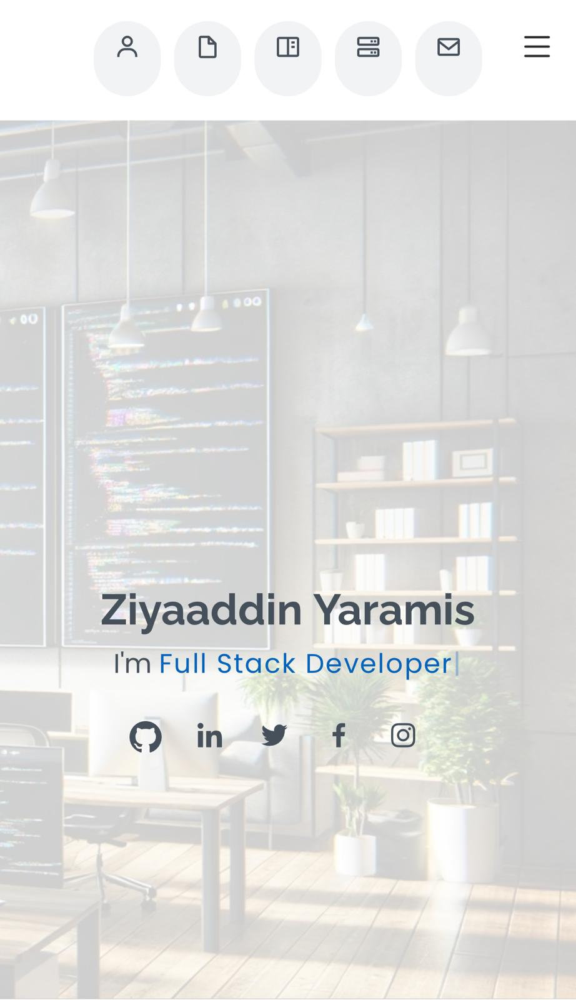

"# ZiyaaddinYaramis.github.io"

# Ziyaaddin Yaramis – Personal Portfolio Website

This is the source code for my personal developer portfolio website:  
🔗 **[ziyaaddinyaramis.github.io](https://ziyaaddinyaramis.github.io/)**

---

## 🔥 Overview

This portfolio website showcases my skills, experience, and real-world projects in:

- 💻 **Full Stack Java Development** (Spring Boot, Hibernate, MySQL)
- 📱 **Flutter Mobile App Development** (Firebase, REST APIs, MVVM)
- 🌐 **Web Development** (React.js, HTML5, CSS3, Bootstrap)
- 🎮 **Game Clones with Kaboom.js**
- 🧠 **Clean Architecture & Agile Development Practices**

---

## 🛠 Technologies Used

- **Frontend**: HTML5, CSS3, JavaScript, Bootstrap
- **Animations & UI**: AOS, Glightbox, Swiper.js, Boxicons
- **Deployment**: GitHub Pages
- **Tools**: VS Code, GitHub, Figma

---

## 🚀 Live Demo

👉 Visit: [https://ziyaaddinyaramis.github.io](https://ziyaaddinyaramis.github.io)

---

### 📄 Template Attribution

This project is based on the [MyResume](https://bootstrapmade.com/free-html-bootstrap-template-my-resume/) template by [BootstrapMade](https://bootstrapmade.com), licensed for free use with attribution.
